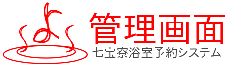

# bath-reserve-console



## feature

This project is a web application for [BathReserve](https://github.com/Yamaji-Toshiyuki/Bath-Reserve) System.

## Branch Information

|branch |description                                        |toPullRequest|
|-------|---------------------------------------------------|-------------|
|master |githubレポジトリに表示したいもの                   |docs等のみ可|
|develop|開発系のfork元．開発したシステムはこちらにマージ   |可|

|branch |CI/CD|Launch Site|description|
|-------|-----|-----------|-----------|
|release| - | - |本番環境(準備中)|
|test   |[](https://dev.azure.com/e17266/BathReserve-console/_build/latest?definitionId=1&branchName=test)|[Link](https://test-bath-reserve-console.azurewebsites.net)|テスト環境|


## Project Build and Compile

Please type this command.

```
yarn install
yarn build
```

### Tips: Customize configuration
See [Configuration Reference](https://cli.vuejs.org/config/).

## License

###### Theme
- [BootstrapVue Argon Dashboard](https://www.creative-tim.com/product/bootstrap-vue-argon-dashboard?partner=134895#)